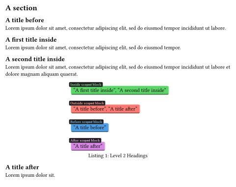

# `typstware`

A monorepo of various [`typst`](https://typst.app) utilities.

## [`scoped`](./scoped)

A library that provides a `scoped` function that constructs a local variant of `query`, to query content only in the current scope:

```typst
#import "scoped/mod.typ": scoped
#import "cards/mod.typ" as cards

= A section

== A title before
#lorem(15)

#scoped(sc => [
	== A first title inside
	#lorem(12)

	== A second title inside
	#lorem(20)

	#let queryAndJoin(selector) = query(selector).map(it => ["] + it.body + ["]).join([, ])
	
	#figure(caption: [Level 2 Headings])[
		#align(left, [
			#cards.outlined(fill: green.lighten(20%))[Inside `scoped` block][
				#queryAndJoin( (sc.inside)(heading.where(level: 2)) )
			]

			#cards.outlined(fill: red.lighten(30%))[Outside `scoped` block][
				#queryAndJoin( (sc.outside)(heading.where(level: 2)) )
			]

			#cards.outlined(fill: blue.lighten(30%))[Before `scoped` block][
				#queryAndJoin( (sc.before)(heading.where(level: 2)) )
			]

			#cards.outlined(fill: purple.lighten(50%))[After `scoped` block][
				#queryAndJoin( (sc.after)(heading.where(level: 2)) )
			]
		])
	]
])

== A title after
#lorem(4)
```


