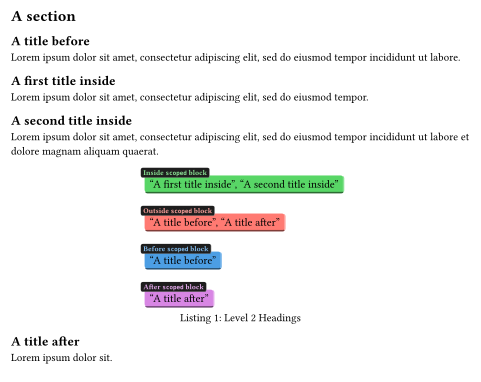

# `typstware`

A monorepo of various [`typst`](https://typst.app) libraries.

To use it locally, clone this repo into `$XDG_DATA_HOME/typst/packages`, or set the `$TYPST_PACKAGE_PATH` environment variable. Make sure to keep the top-level folder named `typstware`.
See [the doc on `typst/packages`](https://github.com/typst/packages#local-packages) for more information.

The packages of this repo can then be imported with:

```typst
#import "@typstware/<package-name>:0.1.0"
```

## [`minijinja`](./minijinja)

Render [`minijinja`](https://docs.rs/minijinja/latest/minijinja/) templates from Typst code, passing regular, potentially nested Typst data to fill in the values.

Current limitations:

- missing values will cause a nondescript error message (which does not mention which value was left undefined), so beware of typos

```svg
<!-- template.svg -->

<svg width="391" height="391" viewBox="-70.5 -70.5 391 391" xmlns="http://www.w3.org/2000/svg" xmlns:xlink="http://www.w3.org/1999/xlink">
<rect fill="#fff" stroke="#000" x="-70" y="-70" width="390" height="390"/>
<g opacity="0.8">
	<rect x="25" y="25" width="200" height="200" fill="{{rect_color}}" stroke-width="4" stroke="pink" />
	<circle cx="125" cy="125" r="75" fill="{{circle_color}}" />
	<line x1="50" y1="50" x2="200" y2="200" stroke="{{line.color}}" stroke-width="{{line.thickness}}" />
</g>
</svg>
```

```typst
#import "@typstware/minijinja:0.1.0" as mnj

#let tmpl = read("template.svg")

Several versions of the template:

#image(
  mnj.render-template(
    tmpl,
    rect_color: green.to-hex(),
    circle_color: yellow.to-hex(),
    line: (
      color: blue.to-hex(),
      thickness: 2
    ),
  ),
  width: 30mm
)

#image(
  mnj.render-template(
    tmpl,
    rect_color: purple.to-hex(),
    circle_color: red.to-hex(),
    line: (
      color: black.to-hex(),
      thickness: 6
    ),
  ),
  width: 30mm
)

Etc, etc.

```

## [`cards`](./cards)

Render card-like containers. See example of use below.

## [`scoped`](./scoped)

A library that implements a `scoped` function which creates a "local scope block" and provides a function to limit selectors to only the current scope:

```typst
#import "@typstware/scoped:0.1.0": scoped
#import "@typstware/cards:0.1.0" as cards

= A section

== A title before
#lorem(15)

#scoped(sc => [
  == A first title inside
  #lorem(12)

  == A second title inside
  #lorem(20)

  #let queryAndJoin(selector) = query(selector).map(it => ["] + it.body + ["]).join([, ])
  
  #figure(caption: [Level 2 Headings])[
    #align(left, [
      #cards.outlined(fill: green.lighten(20%))[Inside `scoped` block][
        #queryAndJoin( (sc.inside)(heading.where(level: 2)) )
      ]

      #cards.outlined(fill: red.lighten(30%))[Outside `scoped` block][
        #queryAndJoin( (sc.outside)(heading.where(level: 2)) )
      ]

      #cards.outlined(fill: blue.lighten(30%))[Before `scoped` block][
        #queryAndJoin( (sc.before)(heading.where(level: 2)) )
      ]

      #cards.outlined(fill: purple.lighten(50%))[After `scoped` block][
        #queryAndJoin( (sc.after)(heading.where(level: 2)) )
      ]
    ])
  ]
])

== A title after
#lorem(4)
```


